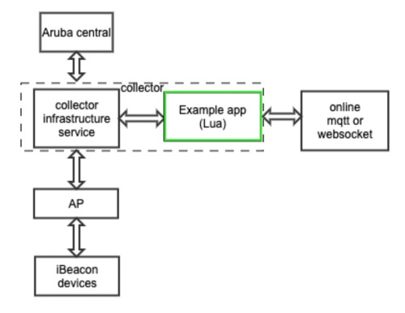
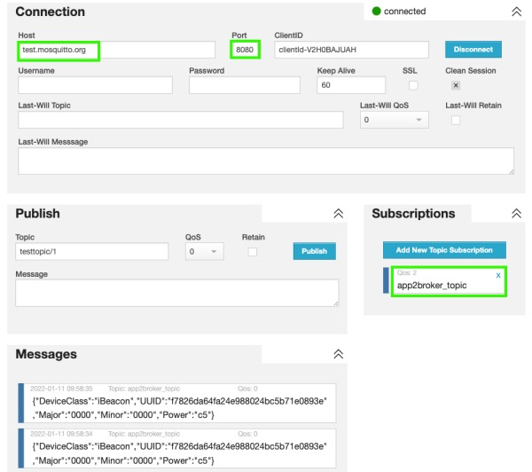

# IoT Operations Example Ble App

This is an example application for HPE Aruba Networking IoT Operations project that guides you to develop your own IoT apps. This app implements the Device Classification and Edge Compute + Data Transport functionalities. Any APIs and Edge Compute functionality can be added as part of your docker container as per your use case.

**Note:** This app uses Lua script for setting the device class attribute. The data transport functionality is written in GoLang.

<br> 1) classifying BLE devices with iBeacon Device Class using a Lua script
<br> 2) taking data from IoT Operations connector and transferring the data to your own cloud service. This app uses <br> HiveMQ as the cloud service as an example.

Before developing your own app, please read the documentation for setting up  your IoT hardware, software and related accounts and configurations related to HPE Aruba IoT Operations,[Configure your IoT setup in HPE Aruba Central](https://www.arubanetworks.com/techdocs/central/latest/content/nms/apps/iot.htm)

Contents
* [Topology](#topology)
* [Project structure](#project-structure)
  * [Lua](#lua)
  * [Container](#container)
    * [Access IoT Operations infrastructure service](#access-iot-operations-infrastructure-service)
* [Build and Application Onboard](#build-and-application-onboard)
  * [Container Build](#container-build)
  * [AppBundle Configuration](#appbundle-configuration)
  * [Installation](#installation)
  * [Data Display](#data-display)
* [License](#license)

## Topology


## Project structure
```
aruba-iotops-example-ble
    |-- container
    |   |-- application
    |   |-- Dockerfile
    |   |-- Makefile
    |-- lua
    |-- resource
    |-- README.md
    |-- VERSION
    |-- LICENSE
```

### lua
The `lua` directory contains a Lua script for BLE device data packets processing.
IoTOps collectors use the Lua scripts to parse BLE device packet data and classify BLE device into Device Classes.
Application developers need to define a `function decode(address, addressType, advType, elements)` function as the entrance of device data processing.
In this example we use a Lua script to decode iBeacon packets. Different devices with different data types and structures should have different scripts.

### container
The `container` directory holds the source code of a containerized program.
IoTOps runs third party applications in a containerized environment.
Application developers can define their own data processing logic and integrate their private solutions using within this container.

In this example, the application receives the subscribed device packets from collector's API Gateway, then forwards the packet to HiveMQ topic.

**Note:** An app developer need not follow this same project structure. The docker container and / or  Lua script can be uploaded via HPE Aruba Networking App Developer Portal (ADP) app creation wizard. This structure and the scripts within should be used as a reference.***

#### Access IoT Operations infrastructure service
Container programs can access collector through HTTP API as follows:
```go
func (c *httpClient) Connect() {
	req, _ := http.NewRequest("GET", "http://$(apiGwUrl)/api/v2/ble/stream/packets", nil)
	req.Header.Set("apikey", "")

	client := &http.Client{}
	resp, _ := client.Do(req)
	defer func() {
		resp.Body.Close()
	}()

	reader := bufio.NewReader(resp.Body)

	for {
		line, err := reader.ReadBytes('\n')
		if err != nil {
			fmt.Println(err.Error())
			return
		}
		fmt.Println(string(data))
	}
}
```

**Note**: More IoTOps API please visit [https://app.swaggerhub.com/apis/davix/aruba_iot_gateway_container_api/2.0](https://app.swaggerhub.com/apis/davix/aruba_iot_gateway_container_api/2.0)

## Build and Application Onboard
### Container Build
```
cd $(BASE_DIR)/container/
make docker
```

### AppBundle Configuration

The IoT app developer should use ADP to create and manage their app. The app creation wizard will walk you through the required and optional fields. The ADP app creation wizard also provides a Lua script editor, where a user can create or upload their Lua script and a docker container library where container images can be uploaded and specified for use in the respective apps. Below is a summary of the required and optional app metadata for the AppBundle for this example.

[required] App Icon  
[required] App Name  
[required] Summary  
[required] Description  
[optional] Release notes for this version of the app  
[required] App support: URL, email or phone of the customer support  
[required] Developer website URL : Author’s website with more information about the App  
[optional] Platform URL  
[optional] Privacy policy URL  
[optional] License agreement URL  
[required] Categories: Choose up to 3 app categories like Enterprise, Location, Hospitality, Networking, etc.  
[required] Supported Platforms : Choose from Legacy AP, AP as IoT Connector and the VM based Data Collector.  
[required] Minimum SDK version : Specify lowest SDK version that your app can support  
[required] App features

**In this example, you would choose BLE and Edge Compute & back end connections** 

BLE section: Enter the details and edit Lua script to decode bluetooth packets

[required] Subscriptions: Create the subscription match for the BLE advertisements  
[required] Match Type : Select one of the folowing subscription types  
           MANUFACTURER ID, SERVICE UUID, Local Name, Device Class  
[required] Match Value : Matching value for current subscription
[optional] Additional Proprietary Value  
[required] Lua Script : Upload your lua script or create a new one
[required] Device classes : Select which device classes your app can classify
[required] Permissions : A list of permissions by device class

Edge Compute & Back end connections section:

[required] Container image for data collector  
[required] CPU usage for mini data collector : Specify max CPU usage on different sizes of the IoT Connector  
[required] Memory usage for mini data collector : Specify max memory usage on different sizes of the IoT Connector  

[required] Subscriptions : Create the subscription match for the container  
[optional] Outbound firewall permissions : Allowlisted URL for external access.
[optional] API Permissions : A list of permissions by device class
[optional] User configuration
[optional] Permissions
[optional] Subscriptions
[optional] Outbound firewall
[optional] Certificates
[optional] Enviroment variables : A list of enviroment variables definitions


### Installation
After config AppBundle, you will see your app in your Aruba central. You only need to config the MQTT topic.
After the installation is complete, you can access [http://www.hivemq.com/demos/websocket-client/](http://www.hivemq.com/demos/websocket-client/) and subscribe MQTT data topic to get data.

### Data Display
Access MQTT web page [http://www.hivemq.com/demos/websocket-client/](http://www.hivemq.com/demos/websocket-client/), subscribe data topic as shown in the image below:
<br>

<br>
On this web page, we will have the following operate step:
1. on Connection part, type "test.mosquitto.org" into Host field, then click "Connect" button  (It will establish a connection with MQTT broker)
2. on Subscriptions part, click "Add New Topic Subscription" button, then it will pop up a window, you should type your own public topic name into Topic field, then click "Subscribe" button. The topic name is set when the app is installed. If you haven't set this topic, we also have default value: "app2broker_topic".
3. on the "Messages" part, you will see the data from your app.

## License
[MIT LICENSE](./LICENSE)
